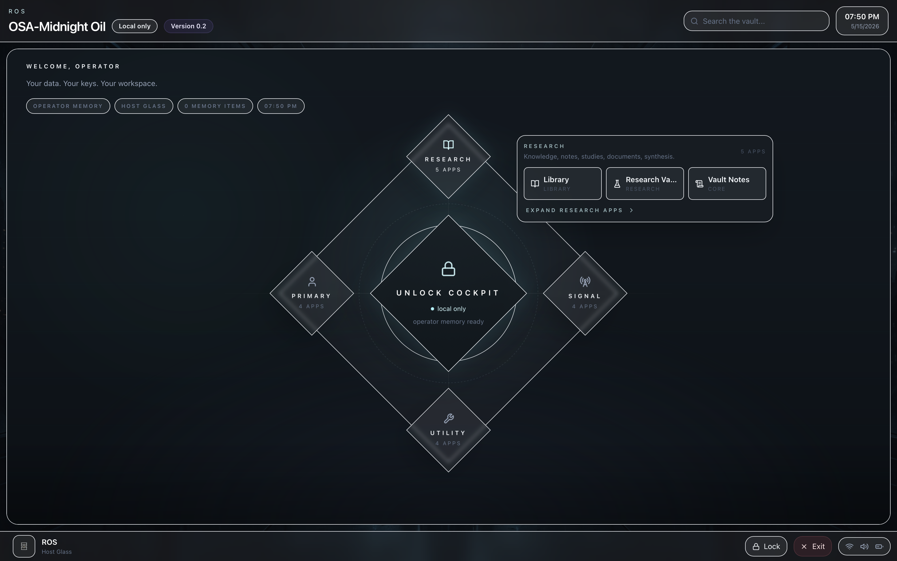
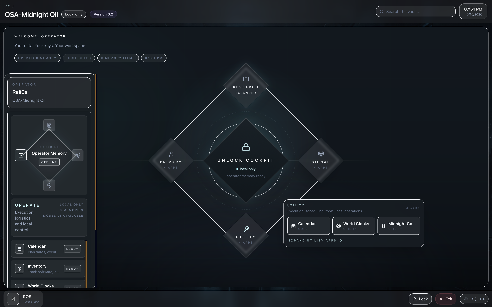
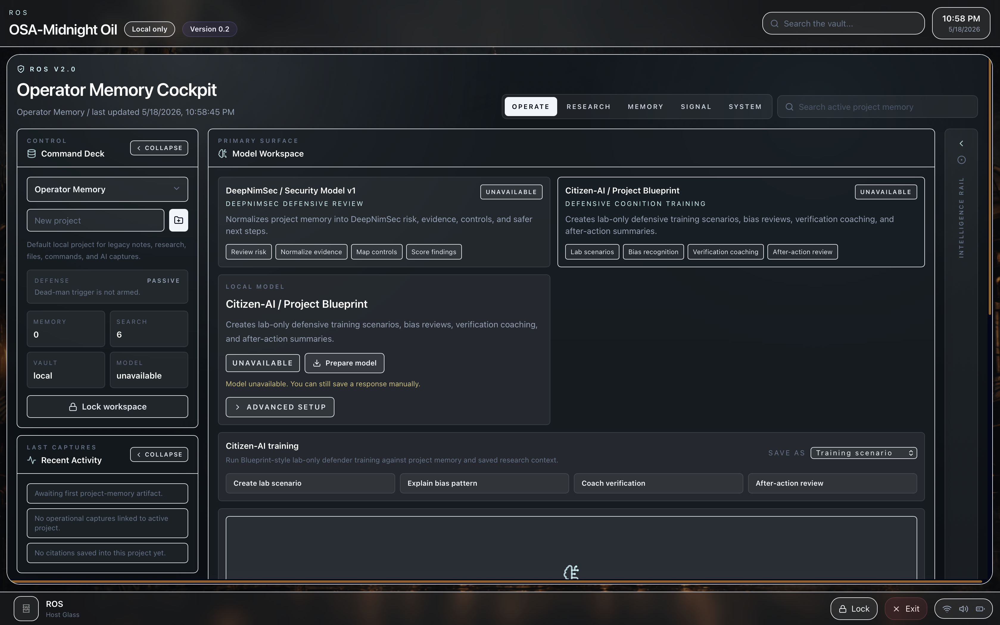

# OSA Midnight Oil

**Version 2 / build v0.2** is the current local-first preview release.

OSA Midnight Oil is a local-first desktop workspace built around a master-locked encrypted vault. It combines planning, note-taking, reference capture, identity organization, wallet storage, research tooling, and a cinematic ROS-style shell into one self-contained environment.

The project is designed to feel like a personal operations desk rather than a cloud app. Workspace data stays local, can be locked behind a passphrase, and is intended to remain useful offline.

## Version 2 Preview

Version 2 tightens the ROS shell into a darker, more focused operator workspace. The v0.2 build highlights the updated entry surface, cockpit treatment, local-first trust posture, and the newer module flow for research, notes, terminal work, and vault-backed workspace state.

## Safe Public Usage

This repository is intended to be safe to inspect, fork, and contribute to. It should contain source code, public documentation, sample placeholders, and release metadata only.

- Do not commit vault snapshots, `.osae` files, `.env*` files, private notes, keys, certificates, tokens, real infrastructure addresses, or machine-specific paths.
- Treat wallet, Nostr, PGP, profile, and workspace data as user-owned private material that belongs only in a local encrypted workspace.
- Security and network-related examples are for defensive, authorized use only.
- Local model features are optional and should point to user-controlled local services, not bundled private endpoints.

## License

OSA Midnight Oil is released under the [MIT License](LICENSE).

## Contributing

Contributions are welcome. Please read [CONTRIBUTING.md](CONTRIBUTING.md) before opening a pull request, and see [SECURITY.md](SECURITY.md) for vulnerability reporting guidance.

## What It Includes

- `Overview`: high-level workspace status, counts, trust summary, and quick capture
- `Vault Notes`: markdown-first notes with structured templates and preview
- `Library`: local document catalog and reader workflow
- `Research Vault`: structured research intelligence records and study comparison
- `Profile Organizer`: identities, VoIP lines, phone book, PGP bundles, and operator records
- `ROS Comms`: local/native secure messaging workflow
- `Nostr Lounge`: lightweight read-first social sidecar
- `F*Society`: native-only LAN room for discovery, chat, handoff notes, and direct file sends
- `Flow Studio`: wireframe flow and system mapping
- `Wallet Vault`: wallet records and sensitive material inside the locked workspace
- `Control Room`: backup, recovery, trust posture, export/import, and destructive controls
- `Midnight Console`: local read-only console into the workspace state

## Local Models

ROS is moving toward a model-first local AI experience. Regular users should see model cards and plain-language capabilities, not raw API setup.

- `Security Model v1 / DNS-v1`: a defensive review model for risk summaries, alert explanation, evidence review, and safer next steps.
- `Citizen-AI`: a lab-only defensive training model for bias review, verification coaching, and after-action summaries.
- `Hugging Face LLM`: a modular adapter that lets operators add a Hugging Face model reference, create a local alias, download it through the local runtime, and run it against ROS project memory.
- Hugging Face sources may be entered as `owner/model`, `hf.co/owner/model`, or full repo URLs such as `https://huggingface.co/deepseek-ai/DeepSeek-V4-Flash/tree/main`; ROS normalizes repo URLs to the local runtime form `hf.co/deepseek-ai/DeepSeek-V4-Flash`.
- The Hugging Face adapter includes a curated GGUF preset picker for local-runtime-ready repos, including compact Llama/Qwen/Mistral options and DeepSeek GGUF alternatives.
- GGUF presets show approximate local download size in GB; Prepare downloads through the local Ollama-compatible runtime into the local model store.
- The first integration phase includes the model catalog and a placeholder bundled-model manifest.
- The actual DNS-v1 model artifact is not included yet.
- Developer and AI-builder settings live behind Advanced setup, where local endpoints and technical model names remain available.

## Security Model

- Workspace data is intended to be encrypted at rest.
- Decrypted workspace state only lives in memory during an unlocked session.
- The shell supports manual lock, idle auto-lock, backup export/import, and nuke/reset flows.
- Native desktop builds move more trust boundaries into Rust/Tauri instead of browser-managed storage.
- Local-first behavior is the default. Cloud sync is not required for core use.

## Runtime Modes

### Web / Beta Compatibility

The Vite app can run in the browser for rapid UI development and beta compatibility.

```bash
npm install
npm run dev
```

### Native Desktop

The primary desktop path lives under [src-tauri](src-tauri) and uses Tauri 2.

```bash
npm run desktop:dev
```

To build desktop artifacts:

```bash
npm run desktop:build
```

If `cargo tauri` is not installed yet:

```bash
cargo install tauri-cli
```

## Standard Scripts

```bash
npm run dev
npm run build
npm run lint
npm run preview
```

Additional project utilities:

- `npm run release:checksums`
- `npm run site:beta:serve`

## Build Notes

- `npm run build` attempts the optional WASM step first. If the `wasm32-unknown-unknown` target or `wasm-pack` is not available, that step is skipped and the Vite build still completes.
- Tauri/Rust build artifacts can consume several gigabytes. If local disk is tight, clearing `src-tauri/target` and `rust-core/target` is the fastest safe cleanup.

## Screenshots

### Version 2 Cockpit



### Version 2 Entry Surface



### Version 2 Workspace Flow



### Secure Workspace Setup


### Dashboard Shell


## Upstream Hygiene

For GitHub upstream, generated artifacts and local machine clutter should stay untracked:

- `dist/`
- `src-tauri/target/`
- `rust-core/target/`
- `dist-landing/`
- `*.osae`
- working notes under `docs/*.txt`
- `.DS_Store`
- local `.env*` files

The repository should primarily contain source, assets that are intentionally part of the product, release metadata, and documentation.

## Project Direction

OSA Midnight Oil is evolving toward a native local-first desktop workspace with:

- stronger Rust-owned trust boundaries
- beta release packaging for macOS, Windows, and Linux
- support/recovery tooling
- structured research and operator workflows
- optional sidecar features like Nostr Lounge and F*Society without turning the core product into a cloud-first platform
